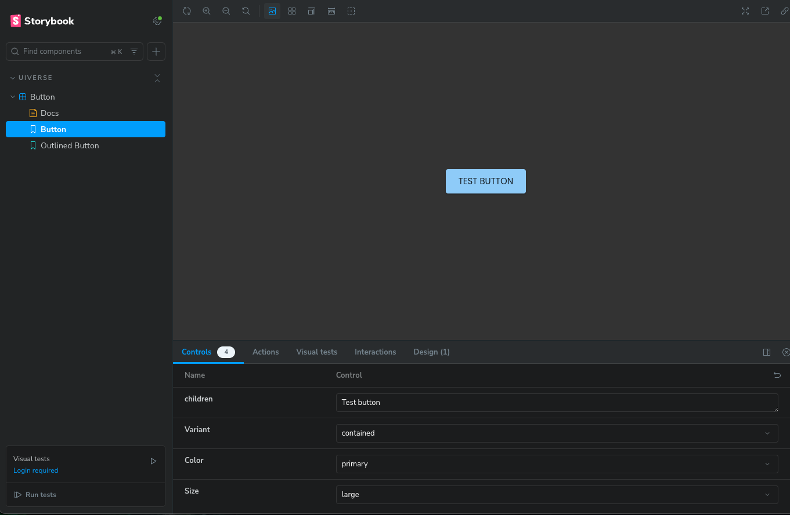
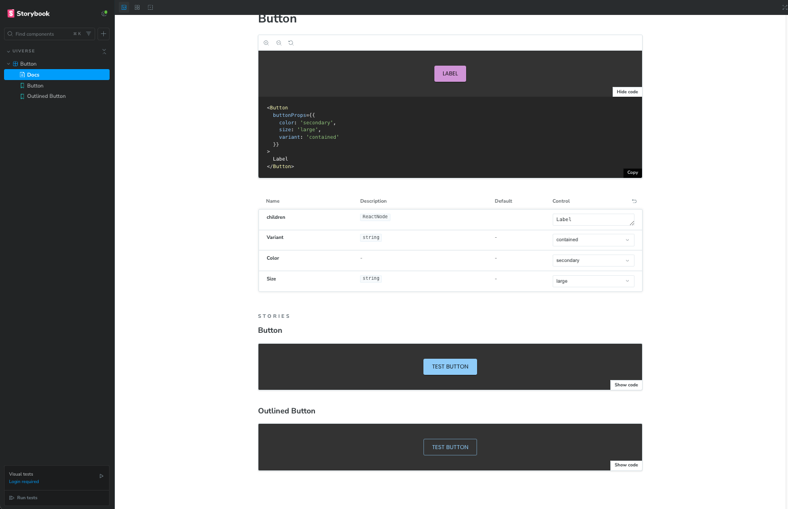

# Why Use Storybook?

Storybook is used to document and test UI components in isolation. It provides a centralized environment where developers and designers can validate the appearance and behavior of components across various states, ensuring consistency and reducing the risk of visual or functional issues in production.

## Table of Contents

- [Why Use Storybook?](#why-use-storybook)
  - [Table of Contents](#table-of-contents)
  - [Example: Using Storybook](#example-using-storybook)
  - [Running Storybook Locally](#running-storybook-locally)
  - [Building Storybook](#building-storybook)
  - [Connect Chromatic to Storybook](#connect-chromatic-to-storybook)
  - [Publish Your Storybook to Chromatic](#publish-your-storybook-to-chromatic)
  - [Enable Visual Testing](#enable-visual-testing)
  - [References](#references)

## Example: Using Storybook

Below is an example of how to use Storybook to create and test components interactively:

```tsx
import type { Meta, StoryObj } from "@storybook/react";
import { Button } from "../uiverse/components";
import Preview from "./preview";

const meta: Meta = {
  title: "uiverse/Button",
  component: Button,
  decorators: Preview.decorators,
  parameters: {
    layout: "centered",
    design: {
      type: "figma",
      url: "https://www.figma.com/componentURL",
    },
    deepControls: { enabled: true },
  },
  tags: ["autodocs"],
  argTypes: {
    "buttonProps.variant": {
      name: "Variant",
      control: "select",
      options: ["contained", "outlined", "text"],
    },
    "buttonProps.color": {
      name: "Color",
      control: "select",
      options: ["primary", "secondary", "error", "warning", "info", "success", "inherit"],
    },
    "buttonProps.size": {
      name: "Size",
      control: "select",
      options: ["large", "medium", "small"],
    },
    children: {
      control: { type: "text" },
      defaultValue: "Test button",
    },
  },
};

export default meta;
type Story = StoryObj<typeof meta>;

export const PrimaryButton: Story = {
  name: "Button",
  args: {
    buttonProps: {
      variant: "contained",
      color: "primary",
      size: "large",
    },
    children: "Test button",
  },
};

export const OutlinedButton: Story = {
  name: "Outlined Button",
  args: {
    buttonProps: {
      variant: "outlined",
      color: "primary",
      size: "large",
    },
    children: "Test button",
  },
};
```

```tsx
import React from "react";
import { Preview as StorybookPreview } from "@storybook/react";
import { Uiverse } from "../uiverse/utils";

const Preview: StorybookPreview = {
  decorators: [
    (Story, { parameters }) => {
      return (
        <Uiverse config={parameters?.config}>
          <Story />
        </Uiverse>
      );
    },
  ],
};

export default Preview;
```

In this example, a custom Preview decorator is used to wrap all stories with additional context or configurations using the Uiverse utility. This approach is helpful for applying global configurations or themes to your components.

## Running Storybook Locally

To use Storybook locally, run the following command in your project:

`npm run storybook`

This will start a local server where you can access the Storybook UI. Here, you can test how your components look and behave, and adjust their arguments dynamically to see the impact of different states or properties.





## Building Storybook

To build your Storybook for production, run the following command:

`npm run build-storybook`

This will generate a static version of your Storybook in the `storybook-static` directory, which you can then deploy to any static hosting service.

## Connect Chromatic to Storybook

Ensure your Storybook instance is properly configured and running. Chromatic works with the stories you define in your Storybook setup. Follow these best practices:

Use well-structured stories to represent all visual states of your components.
Include a wide range of argTypes and props for thorough testing.

## Publish Your Storybook to Chromatic

To publish your Storybook for Chromatic, run the script you added earlier:

`npm run chromatic`

This command:

- Builds your Storybook.
- Uploads it to Chromatic.
- Generates a URL for team members to view and comment on stories.
- Captures snapshots of your components for visual regression testing.

## Enable Visual Testing

Chromatic automatically compares the latest snapshots of your stories against previous ones to detect visual changes. This helps you:

Catch unexpected visual regressions.
Approve or reject changes through the Chromatic UI.

## References

- [Storybook and Figma](https://help.figma.com/hc/en-us/articles/360045003494-Storybook-and-Figma)
- [Figma Plugin for Storybook](https://storybook.js.org/blog/figma-plugin-for-storybook/)
- [How to Integrate Figma Design Systems with Storybook](https://www.youtube.com/watch?v=O3afqyCS2-o&ab_channel=newline)
